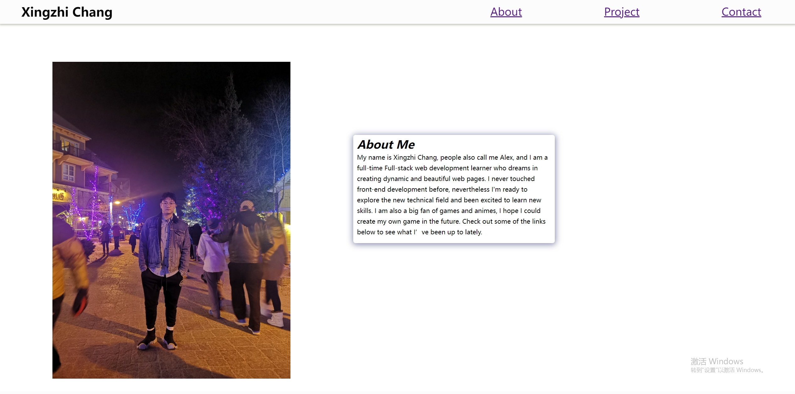
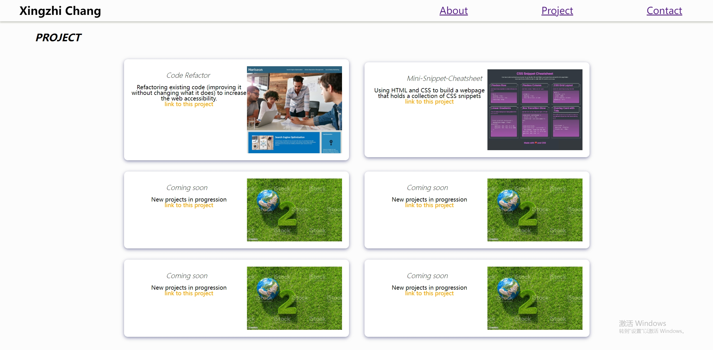
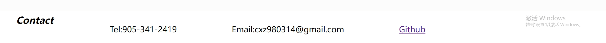

# Portfolio

## Description

The project creates a personal portfolio that contains my recent projects. The website is wrote in pure HTML and CSS, applying the core skills of flexbox, media queries, and CSS variables. The website is designed in responsive layout thus the layout would be changed within the size of the website. Also user could visit my project by clinking the project image or the link aside.

## Link

Click [here](https://jotaroc.github.io/Portfolio/) to the deployed website

## Screenshot

The following image is the sceenshot of web application's appearance and functionality:

> **Note**: This layout is designed for desktop viewing, so you may notice that some of the elements don't look like the screenshot at a resolution smaller than 720px and 420px.
---
Author:Xingzhi Chang
